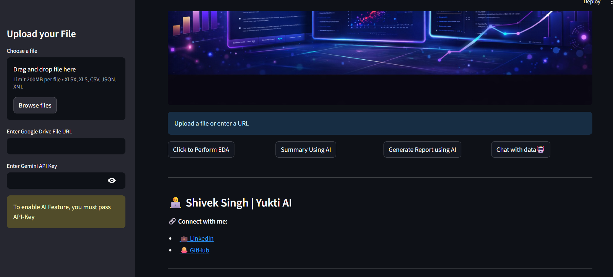
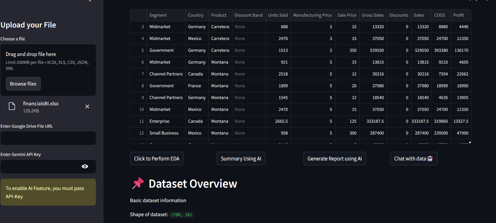
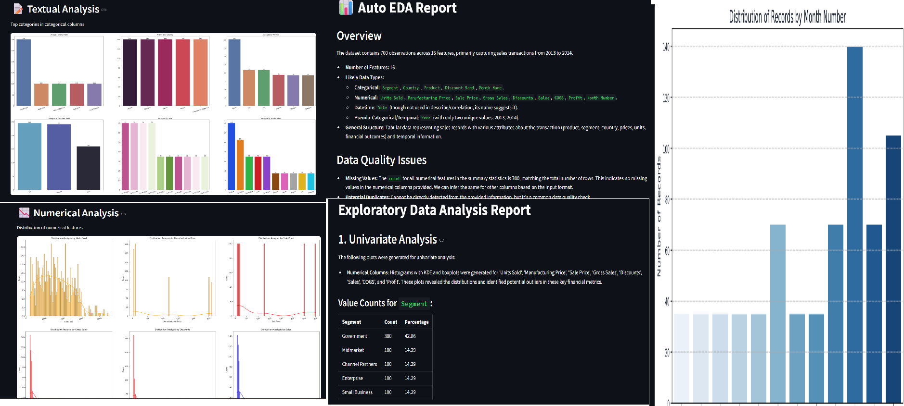
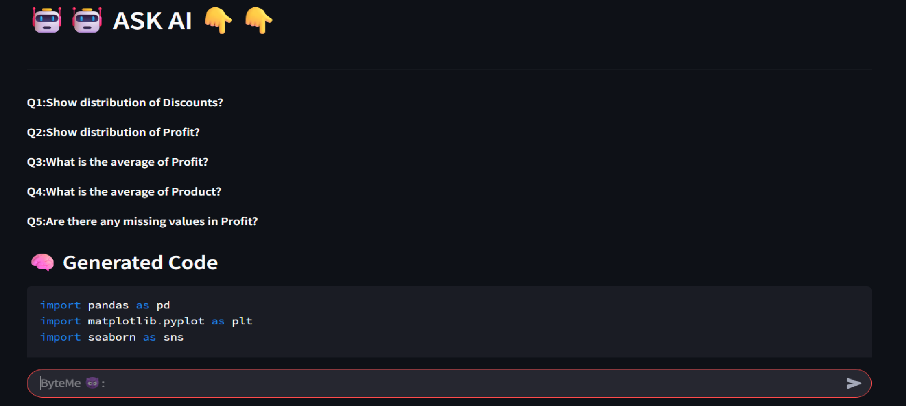

<!-- ================= BANNER ================= -->

  

<h1 align="center">🚀 Yukti AI – Auto EDA with AI</h1>

  <b>Turn raw data into insights instantly using AI 🤖</b>

  
  
  
  

---

## 📌 Overview  

**Yukti AI** is an AI-powered Automated Exploratory Data Analysis (EDA) tool that transforms raw datasets into insights, summaries, and visualizations using natural language.

💡 Just upload your dataset and start asking questions — no coding required.

---

## ✨ Features  

- 📊 Complete Automated EDA  
- 🤖 AI-generated insights (Gemini)  
- 💬 Chat with your data  
- 📈 Smart visualizations  
- ⚡ Natural language → Python execution  
- 🧠 Data storytelling  

---

## 📸 Screenshots  

### 🔹 Dashboard

### 🔹 EDA Output

### 🔹 AI Insights

### 🔹 Chat with Data

---

## 🎥 Demo 

Add your demo video or GIF here:

md

flowchart LR
A[Upload Dataset] --> B[EDA Engine]
B --> C[AI Analysis]
C --> D[Insights + Visuals]
D --> E[User Interaction]
